# Claude Code 手册：AI辅助开发的专业入门指南

> 原文：freeCodeCamp《The Claude Code Handbook》
> 发布日期：2026年3月25日
> 原文链接：https://www.freecodecamp.org/news/claude-code-handbook/

---


> "我从未像今天这样享受编程——因为我不再需要处理那些琐碎的事情。" — **Boris Cherny**，Claude Code 负责人，Anthropic

本手册是 Claude Code 的完整专业入门指南——这是 Anthropic 推出的 AI 驱动软件开发代理，以及使用它构建软件的实践方法。

Claude Code 不是更智能的自动补全工具。它是一个**代理（Agent）**：一个能够阅读你的代码库、思考需要做什么、编写和编辑文件、运行命令、并从头到尾完成任务的系统——由你指导它、验证它的输出、并做出需要判断的决策。它代表了软件构建方式的重大转变，而不是渐进式的改进。

本手册涵盖了从安装和首次会话到并行代理工作流、MCP 集成和自主循环的所有内容。目标不是让你熟悉 Claude Code，而是让你**精通**它。

---

## 目录

1. [第1章：Claude Code 诞生的背景](#第1章claude-code-诞生的背景)
2. [第2章：Anthropic——背景与使命](#第2章anthropic背景与使命)
3. [第3章：Claude 模型家族](#第3章claude-模型家族)
4. [第4章：什么是 Claude Code](#第4章什么是-claude-code)
5. [第5章：为什么开发社区需要这个工具](#第5章为什么开发社区需要这个工具)
6. [第6章：安装和初始设置](#第6章安装和初始设置)
7. [第7章：VS Code 和 Claude Code 扩展](#第7章vs-code-和-claude-code-扩展)
8. [第8章：订阅、Token 成本和用量](#第8章订阅token-成本和用量)
9. [第9章：第一次会话](#第9章第一次会话)
10. [第10章：提示词纪律——输入决定输出](#第10章提示词纪律输入决定输出)
11. [第11章：规划作为核心实践](#第11章规划作为核心实践)
12. [第12章：逐功能构建](#第12章逐功能构建)
13. [第13章：Claude Code 的工作原理](#第13章claude-code-的工作原理)
14. [第14章：使用 Claude Code 良好地设计应用架构](#第14章使用-claude-code-良好地设计应用架构)
15. [第15章：计划模式、编辑模式和操作模式](#第15章计划模式编辑模式和操作模式)
16. [第16章：上下文窗口和会话管理](#第16章上下文窗口和会话管理)
17. [第17章：MCP 服务器和外部集成](#第17章mcp-服务器和外部集成)
18. [第18章：代理、子代理和并行工作流](#第18章代理子代理和并行工作流)
19. [第19章：技能、规则和持久指令](#第19章技能规则和持久指令)
20. [第20章：自主循环——使用条件](#第20章自主循环使用条件)
21. [第21章：代码审查、安全和验证](#第21章代码审查安全和验证)
22. [第22章：入门项目蓝图](#第22章入门项目蓝图)
23. [第23章：Claude Code 的当前前沿](#第23章claude-code-的当前前沿)
24. [第24章：软件工程作为一门学科](#第24章软件工程作为一门学科)
25. [第25章：结构化的前进路径](#第25章结构化的前进路径)

---

## 你将学到什么

读完本手册，你将能够做到以前需要多年工程经验或一个团队才能完成的事情：

- **从零构建真正的应用程序** —— 不是玩具项目或教程复现，而是你打算部署和使用的可工作软件
- **不再等待开发者** —— 自己将想法从概念变为可工作的原型，不依赖他人的时间或预算
- **几小时而非几周交付功能** —— 通过计划模式、逐功能构建和提示词纪律来组织会话，让 Claude 产出你真正想要的
- **跨越数十个会话保持项目活力** —— 管理上下文窗口并保持连续性，永远不会丢失进度
- **连接你的工具** —— 通过 MCP（模型上下文协议）将 Claude Code 链接到 GitHub、Notion、Slack、Google Workspace 等服务
- **像团队一样工作** —— 运行并行代理工作流，产出相当于三四个工程师同时工作的输出
- **避免浪费时间的错误** —— 了解何时以及如何安全地使用自主循环
- **产出你可以负责的代码** —— 按专业标准审查和验证 AI 生成的输出

---

## 这本手册适合谁

### 1. 想要在不同规模上运作的开发者

如果你已经写了多年软件，Claude Code 不是你技能的替代品——它是**放大器**。从中获益最多的开发者不是把它当作自动补全工具使用，而是用它来运行并行会话、委派整个功能工作流、维护本来需要一个团队的代码库、以及以前没有额外人力不可能达到的速度交付。

### 2. 想要移除特定障碍的创始人、产品人员和领域专家

在你继续阅读之前，有一件重要的事需要理解：编写代码只是产品成功所需的一小部分。一个可工作的代码库不会产生用户，不会验证商业模式，不会保证产品市场匹配，也不能替代决定软件是否真正对任何人有用的判断、分发和领域知识。

Claude Code 移除了编码障碍。这个障碍以前很重要：对于非技术人员来说，它往往是让构建无法开始的因素。移除它很重要。但这与移除你和一个在现实世界中运作的产品之间的所有其他障碍不同。

### 3. 任何有想法却无法付诸行动的人

如果阻碍你的具体是代码——不是想法，不是市场，不是分发，而是代码本身——那么这本手册就是为你准备的。它移除了那个特定的障碍。

---

## 为什么这项技能很重要

截至 2026 年初：

- Claude Code 贡献了全球 GitHub 提交的 **4%**
- Spotify 的工程师自 12 月以来就没有手动编写过代码
- Anthropic 自己的团队每天每个工程师发布 **10-30 个 PR**，每一个都由 Claude 生成

指导、评估和使用 AI 工具构建的技能已经是专业人士可以拥有的最有价值的能力之一。随着 AI 变得更加强大，这个价值会增加而不是减少。

---

## 第1章：Claude Code 诞生的背景

软件开发历来是受访问限制的。构建一个可工作的应用程序——如 Web 服务、数据工具或面向用户的产品——要么需要多年的技术培训，要么需要一个有资金的工程师团队。

这个限制随着能够从自然语言描述生成功能代码的大型语言模型的出现而开始消解。在几年的时间里，这已经从对个人开发者的增强变成了软件构建方式的结构性转变。

Boris Cherny 精确地描述了这一点：

> "我想象一个每个人都能编程的世界。任何人都可以随时构建软件。"

他明确地将其与印刷机相提并论——一项将以前由一小群专业人士掌握的能力转移给普通大众的技术，并在此之后带来了人类创造性和智力输出的爆发。

---

## 第2章：Anthropic——背景与使命

Claude Code 是 Anthropic 的产品。要完全理解这个产品，了解构建它的组织是有帮助的。

### 创立与使命

Anthropic 于 2021 年由 Dario Amodei、Daniela Amodei 和几位之前在 OpenAI 工作过的同事创立。创立的动机不是竞争定位，而是对 AI 开发应该如何进行的原则性分歧。

创始人们相信——并继续相信——在没有严格、首要的安全承诺的情况下构建强大的 AI 系统，构成了人类引入的最重大风险之一。他们的回应是建立一个核心目的是并行发展 AI 能力和 AI 安全的组织，将后者不是视为前者的约束，而是一个平等且不可分割的目标。

### 安全在实践中意味着什么

在 Anthropic，安全研究体现在多个层面。最深层的是**机制可解释性**：理解模型内部在单个计算组件层面实际发生了什么的科学努力。

正如 Boris Cherny 所描述的：

> "我们可以识别一个与欺骗相关的神经元。我们开始能够监控它并理解它正在激活。"

在公开发布之前，Claude Code 在 Anthropic 内部运行了四到五个月，在任何外部发布之前都仔细研究了其行为。

### 规模与影响力

到 2026 年初，Anthropic 的估值超过 **3500 亿美元**。据报道，Claude Code 每年产生超过 **20 亿美元**的收入，并继续加速：每日活跃用户在上个月翻了一番。

---

## 第3章：Claude 模型家族

Claude Code 由 Anthropic 的 Claude 模型驱动。模型是系统底层的智能。Claude Code 提供环境——工具、界面、脚手架——但模型决定推理、规划和执行的质量。

### Claude Sonnet 4.6

Claude Sonnet 4.6 是 Anthropic 的中端模型。它在编码任务——规划、实现、调试、文档——上提供强劲性能，每个 token 的成本明显低于 Opus。

对于大多数中等复杂度的开发任务，Sonnet 4.6 是足够的。它能很好地处理单功能实现、调试会话和文档生成。

### Claude Opus 4.6

Claude Opus 4.6 是 Anthropic 最强大的模型。测量其在真实软件工程任务上性能的研究发现，它在 50% 任务完成率下达到约 **14.5 小时**的时间范围——意味着它可以处理占用一个熟练工程师大部分工作日的无人值守工作。

Boris Cherny 专门使用 Opus 4.6，启用最大努力，从不降低能力来节省 token。他的推理很精确：

> "因为一个能力较弱的模型不那么智能，它需要更多的 token 来完成同样的任务。使用更便宜的模型实际上更便宜并不明显。通常，最强大的模型更便宜且消耗更少的 token，因为它以更少的修正完成任务更快。"

### Claude Haiku

Claude Haiku 是 Anthropic 最轻量的模型——快速、便宜，适合简单任务：摘要、简短查询、轻量生成。对于 Claude Code 工作，Haiku 很少是正确的选择。

### 模型选择指南

| 任务特征 | 推荐模型 |
|---------|---------|
| 初始探索、学习 Claude Code | Sonnet 4.6 |
| 中等复杂度开发工作 | Sonnet 4.6 |
| 复杂架构决策 | Opus 4.6 |
| 扩展自主会话 | Opus 4.6 |
| 多代理并行工作流 | Opus 4.6 |
| 简单查询、琐碎问题 | Haiku |

**实用建议**：如果可以的话，不要主要根据成本选择模型。一个需要更多修正周期、更多上下文澄清、更多 token 才能达到可接受输出的能力较弱的模型，总成本经常比一个在更少轮次中完成任务的更强大模型更高。

---

## 第4章：什么是 Claude Code

Claude Code 是一个用于软件开发的 **AI 代理**。这个定义需要拆解。

### 与对话式 AI 的区别

对话式 AI 系统——ChatGPT、基本形式的 Claude.ai、大多数早期 AI 产品——产生文本来回应文本。它可以解释、总结、翻译、起草。它生成人类随后采取行动的输出。AI 本身不在世界中行动。

Claude Code 是**根本不同的**。它是一个**代理**：一个配备了允许它采取行动的工具的 AI 系统。在 Claude Code 会话中，模型不仅仅生成代码片段并返回给你。它读取你项目中的文件，写入和修改这些文件，执行终端命令，安装包，运行测试，搜索网络，提交到版本控制，打开 PR……

### 代理架构

大多数 AI 驱动的开发工具是通过约束模型来构建的：定义僵化的工作流，控制模型可以看到什么，精确指定它可以按什么顺序使用哪些工具。这以牺牲灵活性和能力为代价创造了可预测性。

Claude Code 的架构颠倒了这一点。正如 Boris Cherny 所描述的：**"产品就是模型。"** 方法是尽可能直接地暴露模型，使用最小的工具集和最小的脚手架，并允许模型确定给定任务的最佳方法。

### Claude Code 的运行位置

Claude Code 可在多个平台上使用：

- 终端（Mac、Windows、Linux）
- VS Code 扩展
- Claude 桌面应用程序（Code 标签页）
- Claude iOS 和 Android 应用程序
- GitHub 集成（自动代码审查和 PR 管理）
- Slack 集成

底层代理在所有平台上是相同的。界面不同，但能力相同。

### 当前影响

- 全球 GitHub 提交的 **4%** 由 Claude Code 创作（2026 年初）
- 预计到 2026 年底达到所有提交的 **20%**
- Anthropic 的每日活跃用户在上个月翻了一番
- Anthropic 的工程生产力自 Claude Code 采用以来增加了 **200%**
- Anthropic **100%** 的 PR 在人工审查之前先由 Claude 审查

---

## 第5章：为什么开发社区需要这个工具

### 机械负担

专业软件开发涉及大量与构建好系统的智力挑战无关的机械工作。开发者一天中的很大一部分，在典型的代码库中，涉及：

- 查找语法在版本之间变化的 API 文档
- 第一百次编写认证和授权样板代码
- 设置数据库连接、环境配置、REST 端点
- 解码晦涩的错误消息
- 搜索几乎肯定已经在某处解决的问题的解决方案
- 为正确性已知的行为编写测试
- 管理依赖冲突和破坏性变更

这些都不是工程专业知识得到发挥的地方。这是翻译的开销：将理解转换为语法，在正确的文件中的正确语法。Boris 将其描述为**"琐碎的事情"**和**"乏味的部分"**——消耗时间但不需要重要能力的事情。

Claude Code 消除了这种开销。机械翻译由代理处理。留给工程师的是需要判断的部分：构建什么，如何架构它，它是否正确，它是否服务于其目的。

### 访问障碍

除了专业开发者经历的乏味之外，还有其他所有人面临的结构性障碍。构建功能软件需要多年的技术培训。想法广泛存在。执行它们的能力集中在一小群技术人员中。

Claude Code 重新分配了这种能力。它不消除对理解和判断的需要，但它大大降低了某人可以产生可工作软件的门槛。

---

## 第6章：安装和初始设置

### 步骤 1：设置 Claude 账户

1. 在浏览器中导航到 **claude.ai**
2. 选择"注册"并使用你的电子邮件地址创建账户
3. 确认你的电子邮件地址
4. 你的账户现在已激活

### 步骤 2：选择订阅计划

Claude Code 需要付费订阅。截至 2026 年的可用层级：

#### Claude Pro：每月 $20

Pro 计划提供对 Claude 模型的访问，有每日使用限制。当你达到该限制时，等待到第二天继续。

对于刚开始使用 Claude Code 构建小项目、学习系统、运行中等强度会话的人来说，Pro 计划是足够的。

#### Claude Max：每月 $100 或 $200

Max 计划大幅增加或有效移除使用限制。在 $200 层级，Anthropic 自己的团队描述在正常工作条件下从未遇到使用上限。

如果 Claude Code 成为你工作流程中的主要工具——如果你持续使用它，它会的——Pro 计划会限制你。当你开始定期碰到限制时升级到 Max。

### 步骤 3：访问安装文档

导航到 **code.claude.ai**。这是 Anthropic 的 Claude Code 官方安装中心。它提供：

- Mac 和 Linux 的安装命令（通过 npm）
- Windows 的安装说明（通过 PowerShell）
- IDE 扩展链接

---

## 第7章：VS Code 和 Claude Code 扩展

对于没有终端工作流程的人，VS Code 提供了进入 Claude Code 的最易访问的入口点。

### 为什么选择 VS Code

VS Code 是由 Microsoft 分发的免费开源代码编辑器。它在开发者中拥有超过 **70%** 的市场份额，是当今大多数专业软件开发发生的环境。

VS Code 的 Claude Code 扩展提供了与你通过终端访问的相同底层代理的图形界面。在这个界面中：

- 你的项目文件在持久侧边栏中可见
- Claude 的文件编辑在应用前以差异视图出现（添加为绿色，删除为红色）
- 你可以审查、批准或拒绝单个更改
- 你可以直接从 Claude 面板打开 Claude 引用的任何文件
- 如果你需要，完整的终端仍然可访问

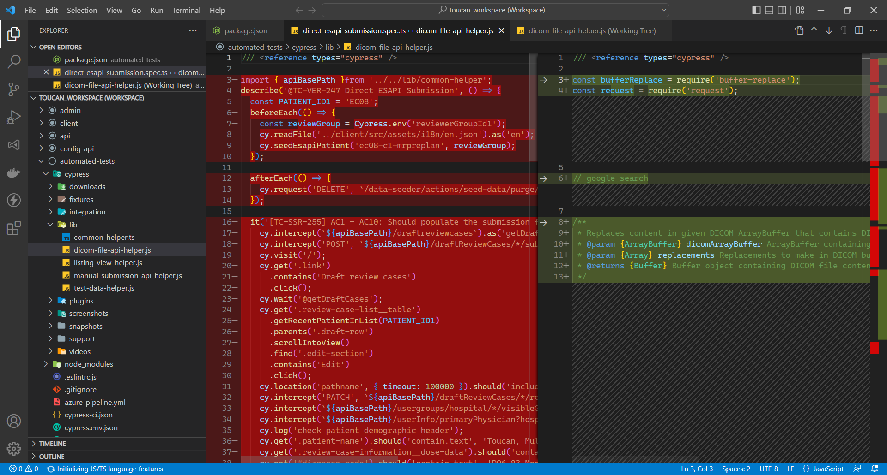
*图：Claude 的文件编辑以差异视图显示，绿色表示添加，红色表示删除*

### 安装 VS Code

1. 导航到 **code.visualstudio.com**
2. 下载适合你操作系统的安装程序
3. 运行安装程序并在每一步接受默认配置
4. 完成后启动 VS Code

### 安装 Claude Code 扩展

1. 在 VS Code 中，找到左侧边栏中的扩展面板
2. 在搜索字段中输入 **Claude Code**
3. 选择官方 Anthropic 扩展并确认它显示数百万次下载
4. 点击安装

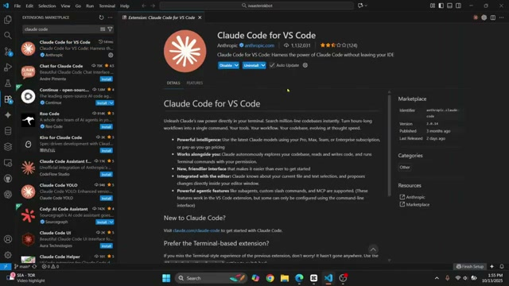
*图：在扩展面板中搜索 Claude Code*

安装完成后，VS Code 工具栏中会出现一个 Claude Code 图标。这将打开 Claude Code 面板。

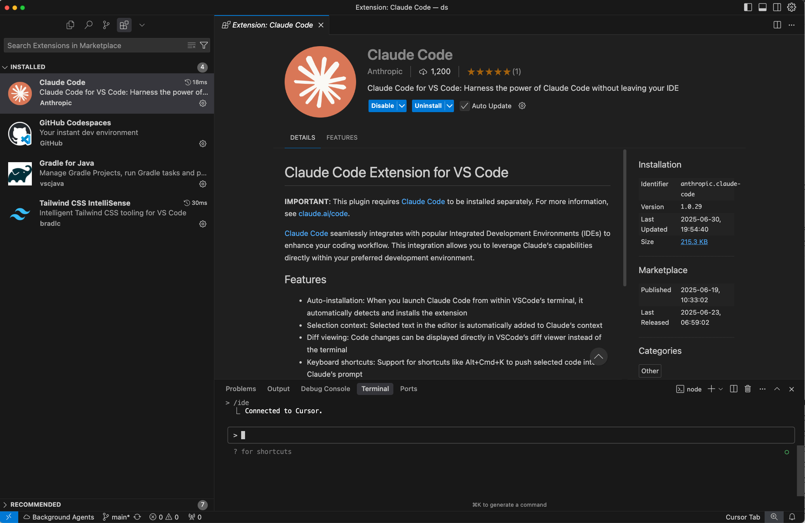
*图：活动栏中的 Claude Code 图标*

### 打开项目

Claude Code 在一个目录中运行——一个包含你项目文件的文件夹。在开始之前，为你的项目创建一个文件夹并在 VS Code 中打开它：

1. 在你系统上任何地方创建一个新文件夹
2. 在 VS Code 中：**文件 → 打开文件夹**
3. 选择并打开该文件夹

点击 Claude Code 图标。Claude Code 面板打开。你准备好开始了。

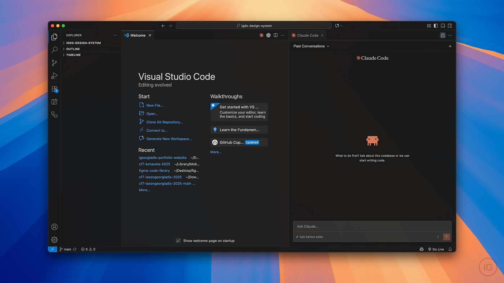
*图：空的 Claude Code 侧边面板*

### 初始配置

第一次打开 Claude Code 时，输入 `/model` 选择你想使用的模型。对于初始会话，Sonnet 4.6 提供了合理的起点。

接下来，输入 `/permissions` 审查权限。默认设置要求 Claude 在修改任何文件之前询问。这在你熟悉 Claude 如何运作之前是合适的。

你可以输入 `/help` 查看所有可用命令。

---

## 第8章：订阅、Token 成本和用量

### 什么是 Token

与 Claude 模型的每次交互都会消耗 token。一个 token 大约对应四分之三个单词——所以 100 个单词的提示和 300 个单词的回复大约代表 530 个 token。

Token 消耗在会话中累积。你发送的每条消息，Claude 生成的每个回复，Claude 读取的每个文件——所有这些都被分词和计数。

### Token 消耗在哪里累积

简短查询消耗的 token 微不足道。但 Claude Code 为之构建的那种工作（阅读现有代码库、规划功能、实现它、纠正方向、运行验证）可以在单个会话中消耗数万个 token。

运行多个并行代理的高级用户消耗更多。Boris Cherny 指出 Anthropic 的一些工程师每月在 token 成本上花费数十万美元。对于这些开发者，Claude Code 取代了本来需要整个工程团队的东西。

### 降低能力的成本

Boris Cherny 关于模型选择的建议解决了一个反直觉的观点：使用能力较弱的模型来降低 token 成本通常会增加总 token 消耗。一个推理较弱的模型需要更多的修正轮次，生成更多的上下文澄清，并且需要更长时间才能收敛到可接受的结果。

他的建议：使用可用的最强大模型。目前是 Opus 4.6。只有当性能要求明显较低且权衡被理解时才降低模型能力。

他阐述的更广泛原则：**"不要试图过早优化。给工程师他们需要的所有 token。在某些东西被证明并正在扩展时，再优化。不是之前。"**

### 实用指南

| 用户画像 | 计划 |
|---------|------|
| 学习、初始项目 | Pro ($20) |
| 定期个人开发 | Max ($100) |
| 专业、持续使用 | Max ($200) |
| 团队或 API 级使用 | Anthropic API（按用量计费）|

---

## 第9章：第一次会话

### 简单开始

合适的起点是一个有立即可见输出的项目。如果你是软件开发新手，Web 项目是最佳的：你写文件，打开浏览器，直接看到结果。反馈循环快速且明确。

一个最小的第一个任务可能看起来像这样：

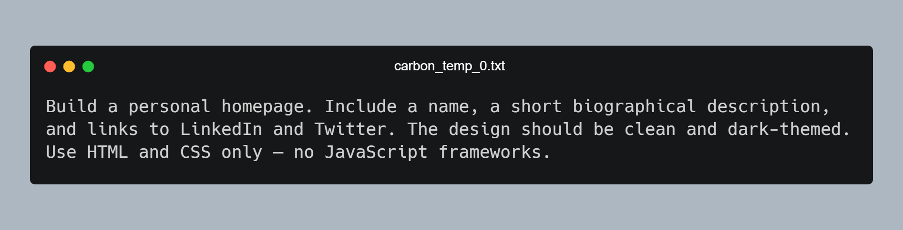

```
构建一个个人主页。包括名字、简短的个人介绍描述、
以及 LinkedIn 和 Twitter 的链接。设计应该干净、深色主题。
只使用 HTML 和 CSS——没有 JavaScript 框架。
```

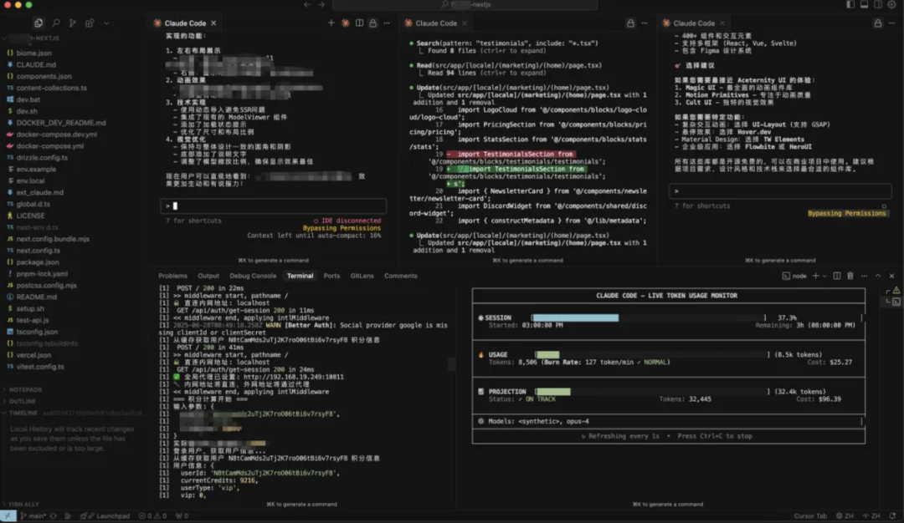
*图：向 Claude Code 发送首次提示*

Claude Code 会：

1. 评估请求并制定计划
2. 请求创建指定文件的权限（如果在默认模式下操作）
3. 编写 HTML 和 CSS 文件
4. 确认产生了什么

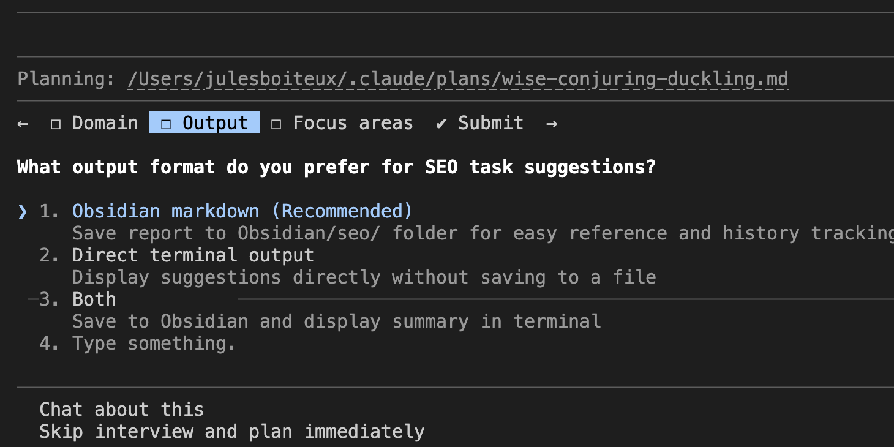
*图：Claude Code 的计划模式输出*

在浏览器中打开生成的 `index.html` 文件。评估它是否符合你的意图。哪里不符合，精确说明需要改变什么。这个循环——提示、输出、评估、完善——是基本的工作方法。

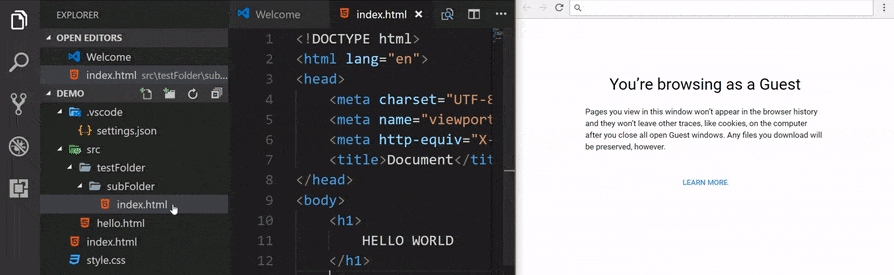
*图：生成的文件在浏览器中的效果*

### 通过迭代学习

对 Claude Code 的熟练程度是通过使用而不是阅读发展的。每一个提示、输出和完善的循环都建立关于如何清晰地指定意图、如何评估 Claude 的输出、以及如何有效地纠正方向的判断。

---

## 第10章：提示词纪律——输入决定输出

提示质量和输出质量之间的关系是直接和一致的。这不是 Claude Code 的限制。相反，它是任何必须将意图转化为行动的系统的属性。

### 核心原则

Claude Code 产生的糟糕结果几乎从来不能归因于模型能力不足。它们归因于**规格不足的提示**。当 Claude 产生与你想要的不匹配的东西时，正确的诊断问题是：*我的规格是否足以产生我想要的东西？*

在大多数情况下，不是。

### 规格需要什么

有效的提示是具体的、上下文的、面向功能的。考虑区别：

**规格不足：**

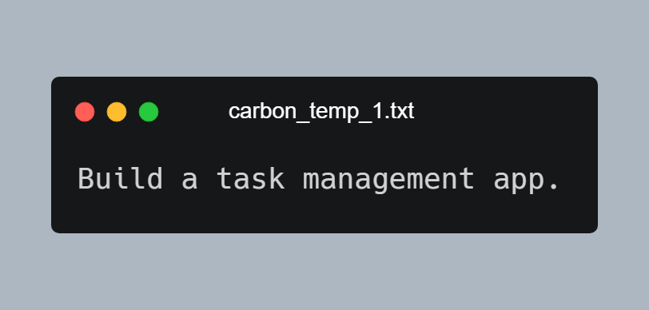

```
构建一个任务管理应用。
```

**规格充分：**

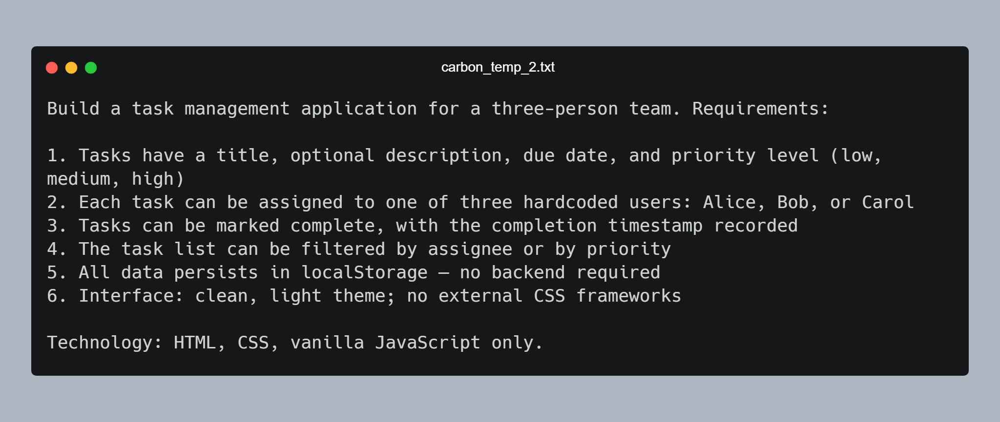

```
为一个三人团队构建一个任务管理应用程序。要求：

1. 任务有标题、可选描述、截止日期和优先级（低、中、高）
2. 每个任务可以分配给三个硬编码用户之一：Alice、Bob 或 Carol
3. 任务可以标记为完成，记录完成时间戳
4. 任务列表可以按受托人或优先级过滤
5. 所有数据持久化在 localStorage 中——不需要后端
6. 界面：干净、浅色主题；没有外部 CSS 框架

技术：仅 HTML、CSS、纯 JavaScript。
```

第二个版本关闭了 Claude 否则会通过假设解决的所有重要决策点。它在第一次就产生了与意图更接近的结果。

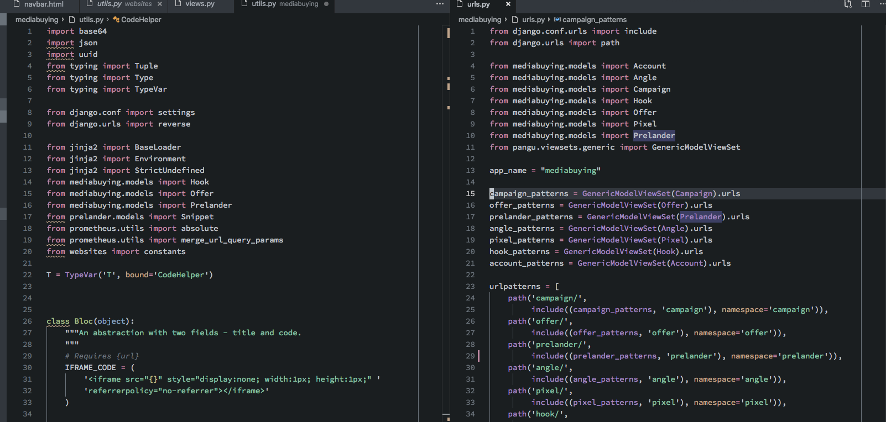
*图：规格不足与规格充分的提示对比*

### 显式优于隐式

即使看起来明显，也要说明你想让 Claude 做什么。如果你想让 Claude 在编写代码之前检查文档，说出来。如果你想要特定的库版本，指定它们。如果你不想更改现有文件，明确说明。如果你想要特定的文件结构，描述它。

隐式期望是经常不满足的期望。显式指令是一致遵循的指令。

---

## 第11章：规划作为核心实践

规划是 Claude Code 开发中杠杆率最高的活动。它也是最常被投资不足的。

### 为什么规划决定结果

一个经过审查和批准的完善计划，在编写任何代码之前，产生三个效果：

1. Claude 将其推理投入到正确的问题上
2. 意图和方法之间的不一致在嵌入代码之前被捕获
3. 结果实现是连贯的，因为它遵循连贯的设计

产生最佳结果的规划时间与开发时间的比例比大多数人最初预期的要高。三十分钟的结构化规划经常将十小时的构建减少到三小时。

### 计划模式

Claude Code 包含一个专门的**计划模式（Plan Mode）**。在这种模式下，Claude 思考任务并产生结构化计划——哪些文件会受影响，实现顺序是什么，数据如何流动，需要处理哪些边缘情况——而不编写任何代码。

Boris Cherny 在大约 **80%** 的会话中使用计划模式。机制本身出奇地简单：注入模型上下文的一句话：*"请先不要编写任何代码。"*

激活计划模式：
- **在终端**：按 Shift+Tab 两次
- **在 VS Code 或桌面应用中**：点击界面中的计划模式按钮

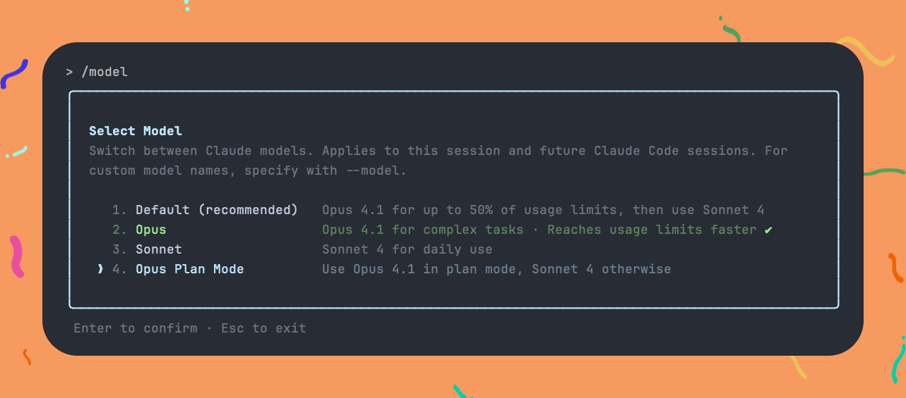
*图：VS Code 中的计划模式按钮*

这里的纪律很重要：**实际阅读** Claude 产生的计划。不要反射性地批准它。计划是你可以以最小成本干预的点。

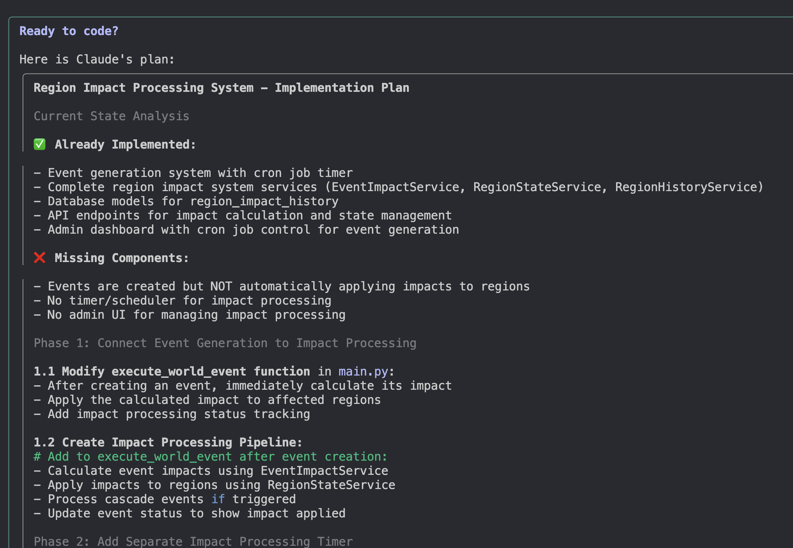
*图：计划模式的详细输出示例*

### 产品需求文档

规划会话的正式输出是**产品需求文档（PRD）**。对于个人项目，这不需要很详尽。它应该包含：

1. 正在构建什么以及为谁的清晰声明
2. 功能的具体列表，每个用行为术语描述
3. 技术要求：技术栈、数据库、外部 API、要支持的浏览器
4. 界面参数：视觉风格、布局决策、交互模型
5. 明确的完成标准

项目根目录的 `PRD.md` 文件，可在每个会话开始时被 Claude Code 读取，提供跨会话持久的一致上下文。

### 访谈方法

生成完整 PRD 的有用技术是指示 Claude 在规划任何事情之前就项目采访你：

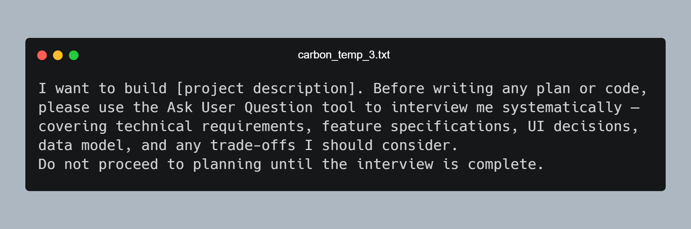

```
我想构建 [项目描述]。在编写任何计划或代码之前，
请使用询问用户问题工具系统地采访我——
涵盖技术要求、功能规格、UI 决策、
数据模型以及我应该考虑的任何权衡。
在采访完成之前不要继续规划。
```

---

## 第12章：逐功能构建

规划好的项目是增量构建的。你应该抵制在单次尝试完整实现的冲动。逐功能开发不是更慢——它更可靠、更可验证，最终更快。

### 增量开发的理由

每个实现的功能都是可以独立验证的行为单元。如果功能 2 建立在功能 1 之上而没有验证功能 1，缺陷就会复合。基础中的缺陷向上传播，嵌入到建立在其上的所有东西中。

每个验证过的功能也是一个稳定的平台，可以在其上自信地构建下一个功能。

### 构建周期

对于 PRD 中的每个功能：

1. **详细指定功能。** 提供功能描述和任何补充上下文：将涉及的文件、实现约束、验收标准。

2. **进入计划模式并审查计划。** 阅读 Claude 提议的方法。它与你的设计意图一致吗？它会影响它不应该触及的文件吗？数据流正确吗？如有必要修改计划。

3. **批准并释放到实现。** 一旦计划合理，释放 Claude 来实现。审查每个文件更改的差异视图。

4. **测试功能。** 手动执行功能的预期行为。故意测试边界条件。

5. **解决任何差异。** 精确说明什么是不正确的并要求 Claude 纠正它。

6. **确认并前进。** 当功能正确工作时，移动到下一个。

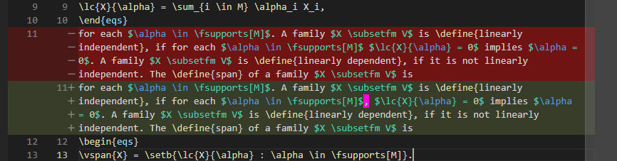
*图：单功能更改的差异视图*

### 适合的起始项目

| 项目 | 理由 |
|------|------|
| 个人主页 | 即时视觉反馈，单个 HTML/CSS 文件 |
| 简单计算器 | 具体逻辑，可验证输出 |
| 任务列表应用 | 多功能结构，基础 CRUD 模式 |
| 静态作品集 | 实用结果，可立即分享 |
| 数据展示仪表板 | 结构化数据和布局入门 |

---

## 第13章：Claude Code 的工作原理

从技术层面理解 Claude Code 的机制会改变你使用它的方式。

### 代理循环

在其核心，Claude Code 作为一个**推理循环**运行。每个会话，每一步，都遵循相同的底层周期：

1. **接收输入**：来自你的消息，或先前工具调用的结果
2. **推理**：确定下一步采取什么行动
3. **选择工具**：选择调用哪个能力
4. **执行工具**：采取行动
5. **观察结果**：接收工具返回的内容
6. **再次推理**：根据新信息确定下一个行动
7. **重复**：直到任务完成或需要输入

模型是推理引擎。工具提供双手。循环提供结构。

### 工具调用如何工作

Claude Code 可以访问一组特定的工具：

| 工具 | 它做什么 |
|------|---------|
| `read_file` | 以文本形式返回文件内容 |
| `write_file` | 将内容写入文件，如果不存在则创建 |
| `edit_file` | 对现有文件应用特定更改 |
| `run_command` | 执行 shell 命令并返回 stdout 和 stderr |
| `list_directory` | 返回路径的文件和目录结构 |
| `search_files` | 搜索文件内容中的模式 |
| `web_search` | 查询网络并返回结果 |
| `ask_user` | 暂停并请求你的输入 |
| `browser` | 打开浏览器并与网页交互 |

这就是为什么计划模式如此强大：它让 Claude 执行循环的推理部分——决定它会使用哪些工具，按什么顺序，用于什么目的——而不实际执行这些工具。

### Claude 如何读取代码库

当你在 Claude Code 中打开项目时，Claude 不会自动读取你所有的文件。它按需选择性地读取，随着循环需要。

重要含义：

1. **Claude 对你代码库的视图总是部分的**。如果相关的东西存在于 Claude 尚未读取的文件中，Claude 不知道它。

2. **CLAUDE.md 文件总是首先被读取**。因此，你的 `CLAUDE.md` 是编码约定的最可靠的地方。

3. **你可以引导 Claude 的注意力**。在你的提示中，你可以命名特定文件。

---

## 第14章：使用 Claude Code 良好地设计应用架构

### 结构与提示质量之间的联系

代码库的组织方式与 Claude Code 在其中工作的效果之间存在直接关系。一个结构良好的代码库是：

- 每个文件都有单一、可识别的职责
- 文件和目录名准确反映其内容
- 组件之间的依赖关系单向流动
- 配置与逻辑分离
- 外部集成在定义的边界内隔离

### 单一职责原则的应用

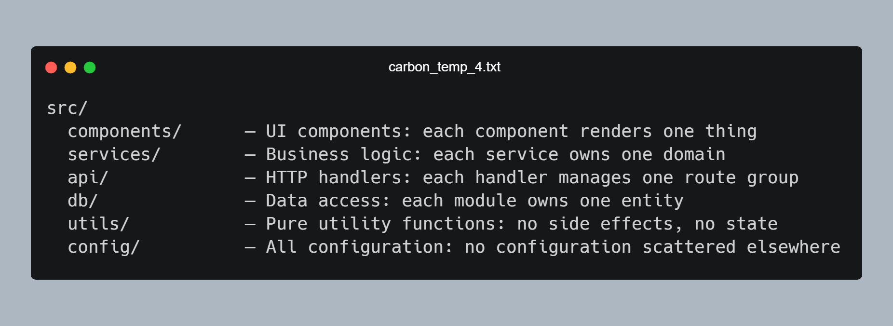

```
src/
  components/      — UI 组件：每个组件渲染一件事
  services/        — 业务逻辑：每个服务拥有一个领域
  api/             — HTTP 处理器：每个处理器管理一组路由
  db/              — 数据访问：每个模块拥有一个实体
  utils/           — 纯工具函数：无副作用，无状态
  config/          — 所有配置：没有配置散布在其他地方
```

### 在 CLAUDE.md 中定义"完成"

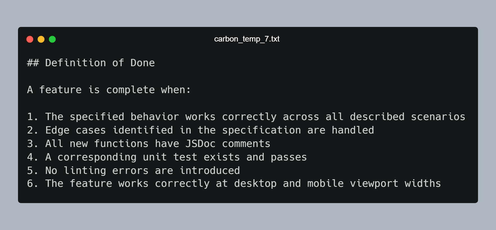

```markdown
## 完成的定义

一个功能完成当：

1. 指定的行为在所有描述的场景中正确工作
2. 规格中识别的边缘情况被处理
3. 所有新函数都有 JSDoc 注释
4. 存在相应的单元测试并通过
5. 没有引入 linting 错误
6. 功能在桌面和移动视口宽度都正确工作
```

---

## 第15章：计划模式、编辑模式和操作模式

Claude Code 的操作模式控制它在执行任务时的行为方式。

### 计划模式

Claude 推理——它不编写。用它来开始任何非平凡复杂度的任务。

### 编辑前询问

这是默认模式。在修改任何现有文件或创建新文件之前，Claude 展示提议的更改并请求明确批准。

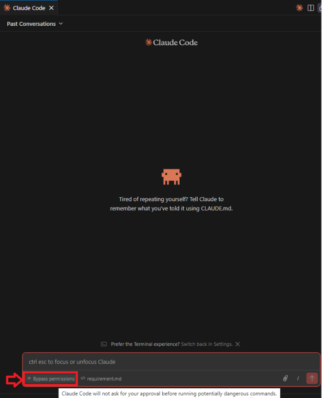
*图：权限模式选择器*

### 自动编辑模式

在这种模式下，Claude 编写文件而不在每次更改之间请求批准。这只有在你使用了计划模式并且你已经审查和批准了计划之后才合适。

Boris 描述了转换：

> "一旦计划看起来不错，我就让模型执行。之后我自动接受编辑。用 Opus 4.6，它几乎每次都一次性正确完成。"

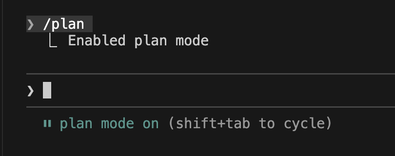
*图：使用 Shift+Tab 切换计划模式*

---

## 第16章：上下文窗口和会话管理

每个 Claude 会话在一个**上下文窗口**内运行——模型可以同时持有的信息总量。当该窗口填满时，较旧的信息被压缩或丢失。

### 上下文窗口

对于 Claude Opus 4.6，上下文限制是 **200,000 个 token**——大约相当于 150,000 个单词，或大约 200-300 页文本。

上下文饱和的症状是**漂移**：Claude 开始做出与它在会话早期建立的约束不一致的决策。

### 50% 实践

有经验的 Claude Code 用户中的工作惯例：当上下文使用达到 **40-50%** 时，开始新会话。

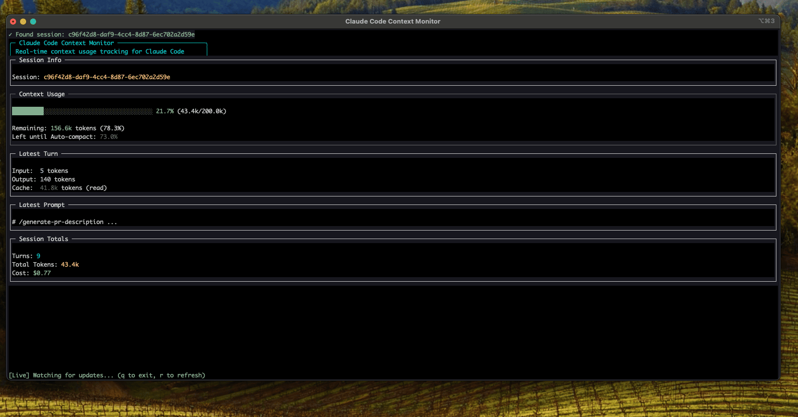
*图：上下文使用百分比指示器*

### 跨会话连续性

#### 四个连续性文档

**`CLAUDE.md` — 项目约定和架构上下文**

这个文件位于项目根目录。Claude Code 在每个会话开始时自动读取它。

**`PRD.md` — 正在构建什么**

产品需求文档用行为术语定义完整的功能集。

**`README.md` — 当前实现状态**

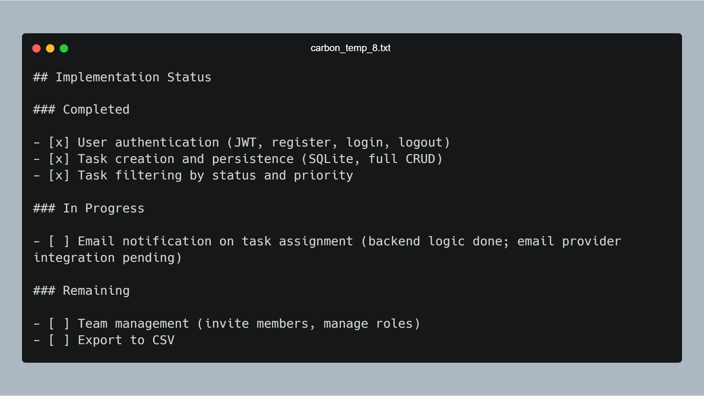

```markdown
## 实现状态

### 已完成

- [x] 用户认证（JWT，注册，登录，登出）
- [x] 任务创建和持久化（SQLite，完整 CRUD）
- [x] 按状态和优先级过滤任务

### 进行中

- [ ] 任务分配时的电子邮件通知（后端逻辑完成；电子邮件提供商集成待定）

### 剩余

- [ ] 团队管理（邀请成员，管理角色）
- [ ] 导出到 CSV
```

**`progress.md` — 会话级笔记和决策**

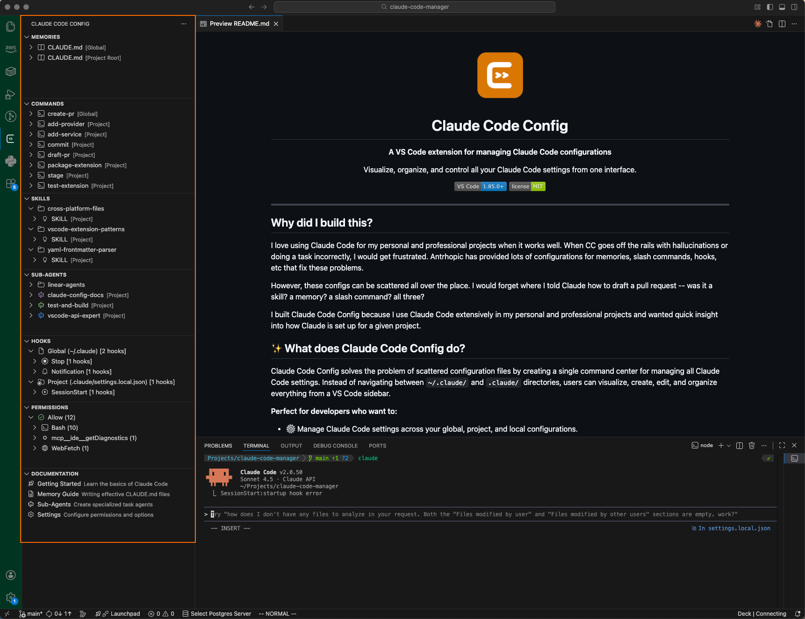
*图：项目根目录的会话文件*

#### Claude 如何访问它们

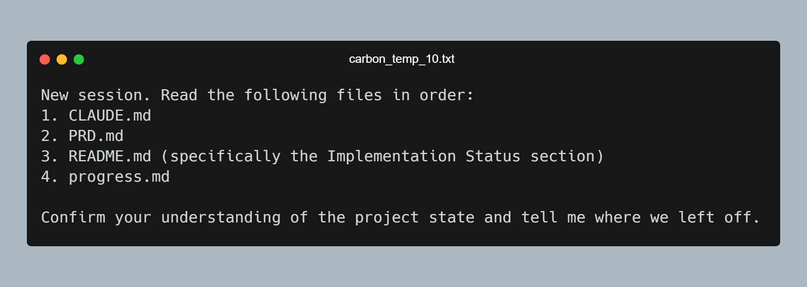

```
新会话。按顺序读取以下文件：
1. CLAUDE.md
2. PRD.md
3. README.md（特别是实现状态部分）
4. progress.md

确认你对项目状态的理解并告诉我我们停在哪里。
```

---

## 第17章：MCP 服务器和外部集成

**MCP（模型上下文协议）** 是 Anthropic 将 AI 代理连接到外部工具、服务和系统的开放协议。

### MCP 启用什么

开箱即用，Claude Code 可以读写文件、执行终端命令和搜索网络。MCP 将其扩展到包括几乎任何暴露兼容接口的应用程序或服务。

### 代表性 MCP 应用

**GitHub（默认包含）：**
- 直接从 Claude 会话打开 PR
- 审查传入的 PR 并添加行内注释
- 监控 CI/CD 失败并提出修正

**Notion：**
- 读取项目笔记和规格
- 更新任务状态
- 创建文档页面

**Google Workspace：**
- 读写 Google Docs 和 Sheets
- 通过 Gmail 撰写和发送电子邮件

**Playwright（浏览器自动化）：**
- 打开真实浏览器会话
- 导航到 URL 并完成表单交互
- 从网页提取结构化数据

### 安装 MCP 服务器

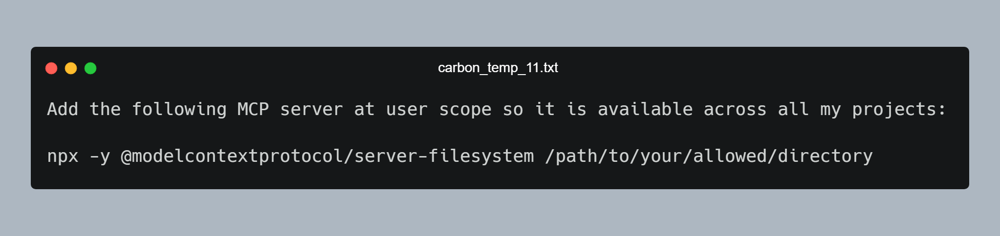

```
添加以下 MCP 服务器在用户范围，这样它在我所有项目中都可用：

npx -y @modelcontextprotocol/server-filesystem /path/to/your/allowed/directory
```

安装后，输入 `/mcp` 验证连接的服务器：

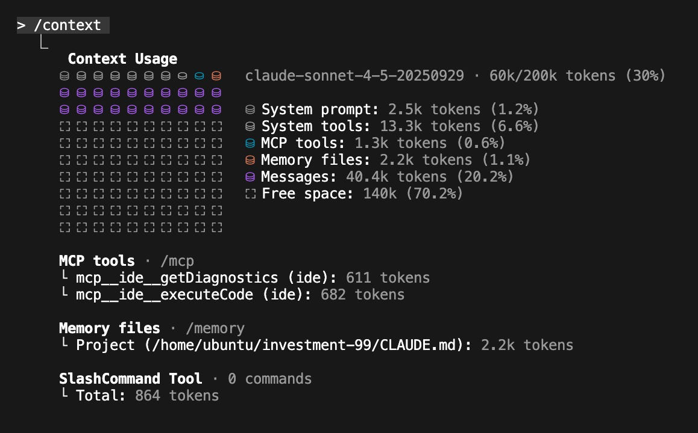
*图：MCP 命令列表输出*

### 实用 MCP 集成

**GitHub：最有价值的集成**

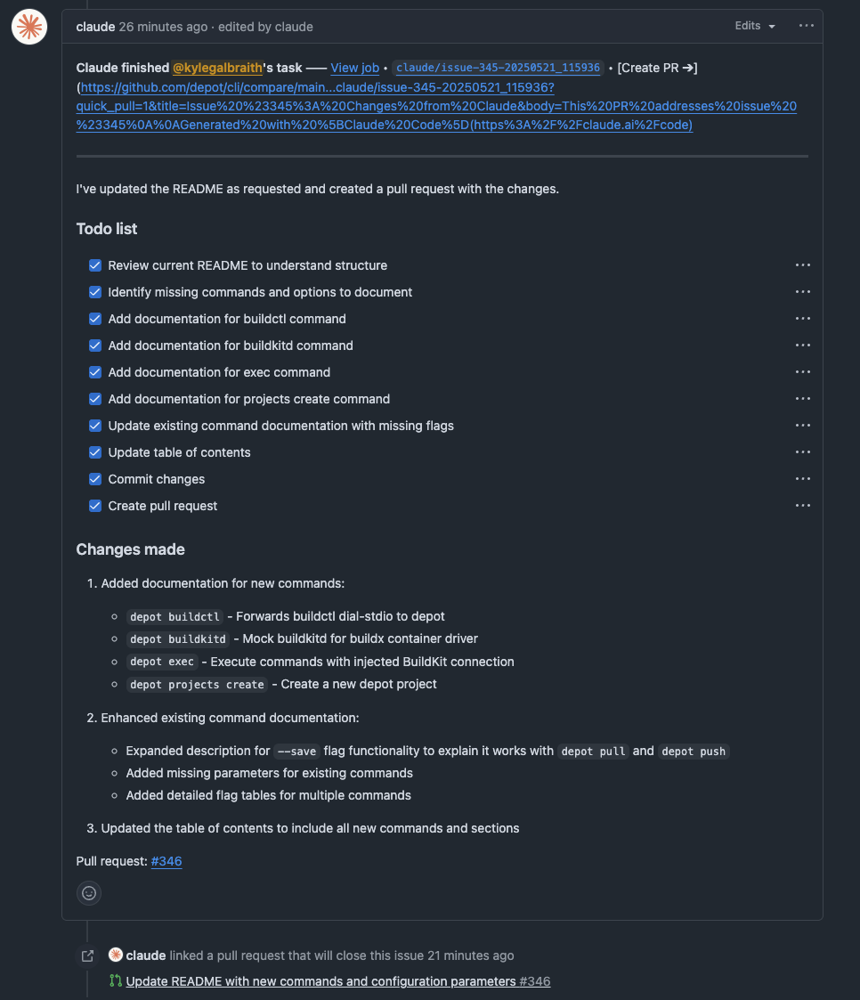
*图：GitHub MCP 操作执行*

常见用法：

```
为功能分支 `feature/auth-redesign` 打开一个 PR 到 `main`。
标题：'Auth: JWT token refresh'。
描述：总结你在这个会话中做的更改。
```

---

## 第18章：代理、子代理和并行工作流

随着你对 Claude Code 的熟练程度发展和提高，自然的扩展是**并行操作**：多个 Claude 会话同时运行，每个处理不同的工作流。

### 并行会话结构

多个 Claude Code 会话，每个分配特定范围，复制小团队的并行能力。一个会话构建认证系统。另一个构建数据可视化层。第三个为已完成的功能编写测试。

Boris Cherny 通常同时运行五个或更多并行会话。他对工作流的描述：*"我启动一个任务，然后另一个，然后另一个，然后去喝杯咖啡让它们运行。"*

### 运行并行会话——具体示例

#### 窗口 1：前端会话

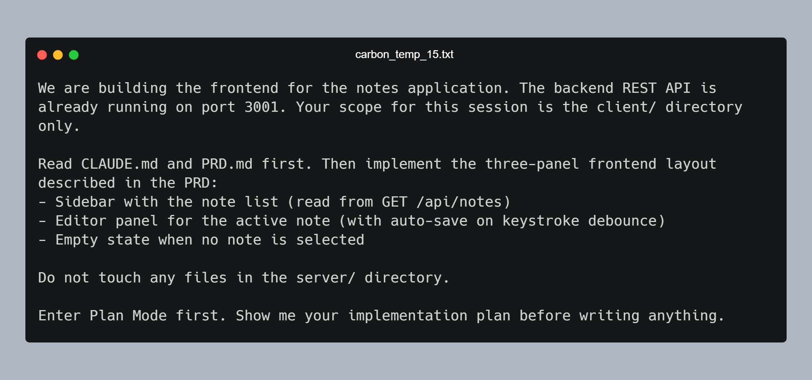

```
我们正在为笔记应用程序构建前端。后端 REST API
已经在端口 3001 上运行。你在这个会话中的范围只是 client/ 目录。

首先读取 CLAUDE.md 和 PRD.md。然后实现 PRD 中描述的三面板前端布局：
- 带有笔记列表的侧边栏（从 GET /api/notes 读取）
- 活动笔记的编辑器面板（带有按键防抖自动保存）
- 未选择笔记时的空状态

不要触及 server/ 目录中的任何文件。

首先进入计划模式。在写任何东西之前向我展示你的实现计划。
```

#### 窗口 2：测试套件会话

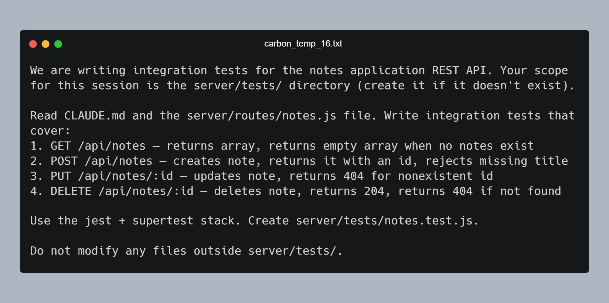

```
我们正在为笔记应用程序 REST API 编写集成测试。你在这个会话中的范围
是 server/tests/ 目录（如果不存在则创建它）。

读取 CLAUDE.md 和 server/routes/notes.js 文件。编写覆盖以下内容的集成测试：
1. GET /api/notes — 返回数组，当没有笔记存在时返回空数组
2. POST /api/notes — 创建笔记，返回带 id 的笔记，拒绝缺少标题的请求
3. PUT /api/notes/:id — 更新笔记，对不存在的 id 返回 404
4. DELETE /api/notes/:id — 删除笔记，返回 204，如果未找到返回 404

使用 jest + supertest 技术栈。创建 server/tests/notes.test.js。

不要修改 server/tests/ 之外的任何文件。
```

两个会话现在同时运行。

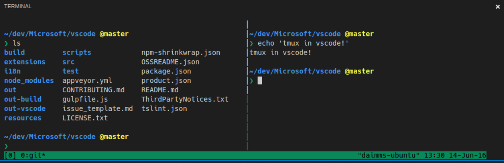
*图：VS Code 中的并行 Claude Code 会话*

### 用于安全并行开发的 Git 工作树

**Git 工作树**是链接到同一仓库的额外工作目录。每个工作树检出不同的分支，每个都有自己的磁盘文件集。

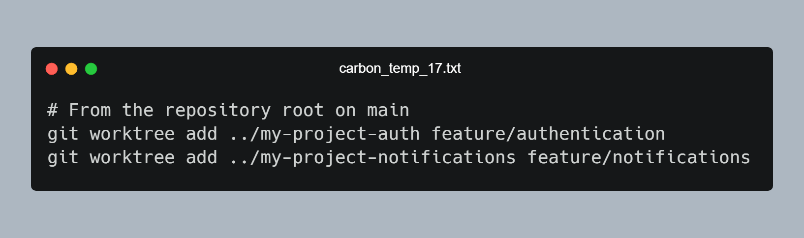

```bash
# 从 main 分支的仓库根目录
git worktree add ../my-project-auth feature/authentication
git worktree add ../my-project-notifications feature/notifications
```

完成后正常合并：

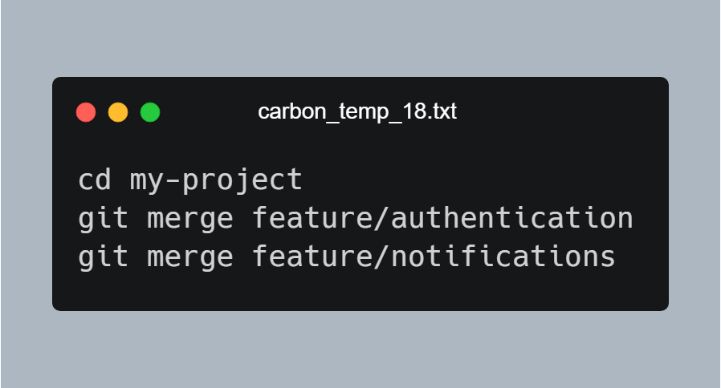

```bash
cd my-project
git merge feature/authentication
git merge feature/notifications
```

---

## 第19章：技能、规则和持久指令

Claude Code 可以被给予跨会话持久的项目特定指令。

### CLAUDE.md 文件

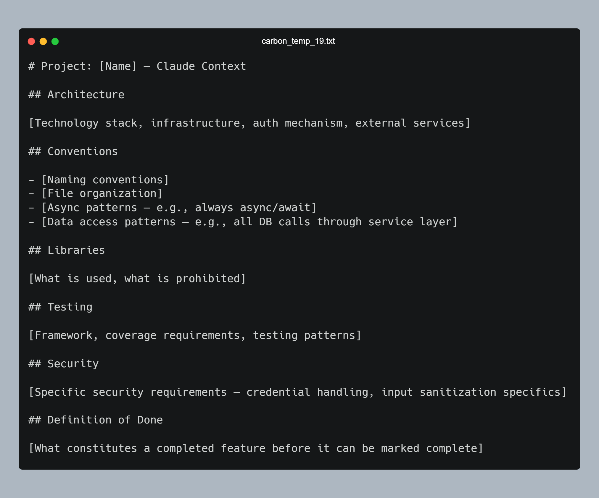

```markdown
# 项目：[名称] — Claude 上下文

## 架构
[技术栈、基础设施、认证机制、外部服务]

## 约定
- [命名约定]
- [文件组织]
- [异步模式——例如，始终 async/await]
- [数据访问模式——例如，所有 DB 调用通过服务层]

## 库
[使用什么，禁止什么]

## 测试
[框架、覆盖要求、测试模式]

## 安全
[特定安全要求——凭证处理、输入消毒细节]

## 完成的定义
[功能完成并可标记完成的构成要素]
```

---

## 第20章：自主循环——使用条件

**自主循环操作**——Claude Code 在步骤之间不需要人工批准的情况下执行任务序列——经常被讨论也经常被误用。

### 循环放大质量和缺陷

如果任务规格中存在误解，循环将执行与该误解一致的所有后续任务。错误不会自我纠正。它累积。

来自从业者的实用建议：**先不用循环构建**。发展判断力后再引入自主循环。

### 适合循环的任务

- 为系统定义的一组函数添加文档
- 为具有清晰行为的组件生成测试
- 在一致的文件集上应用定义的重构模式

### 不适合循环的任务

- 构建范围未完全定义的新功能
- 需要创造性决策的架构工作
- 在不熟悉的代码库中可能出现意外条件的工作

### 具体示例

**有循环的自主批处理：**

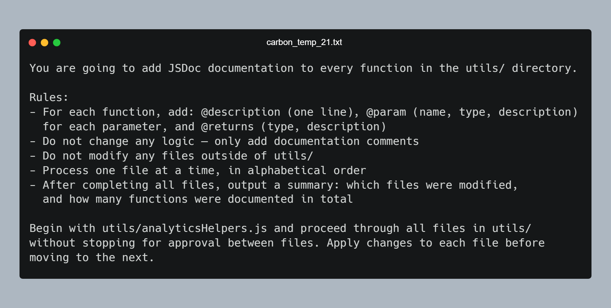

```
你将为 utils/ 目录中的每个函数添加 JSDoc 文档。

规则：
- 对于每个函数，添加：@description（一行），@param（名称，类型，描述）
  对于每个参数，以及 @returns（类型，描述）
- 不要更改任何逻辑——只添加文档注释
- 不要修改 utils/ 之外的任何文件
- 按字母顺序一次处理一个文件
- 完成所有文件后，输出摘要：修改了哪些文件，
  以及总共记录了多少函数

从 utils/analyticsHelpers.js 开始，按顺序处理 utils/ 中的所有文件
不要在文件之间停止请求批准。在移动到下一个文件之前对每个文件应用更改。
```

---

## 第21章：代码审查、安全和验证

Claude Code 的能力不消除验证的要求。

### 已知的失败类别

1. **API 幻觉**：Claude 可能引用不存在或已更改的函数、参数或库版本
2. **边缘情况遗漏**：可能没有完全解决边界条件的实现
3. **安全漏洞引入**：SQL 注入、不充分的输入消毒等
4. **自信的错误**：回复的语气不是其准确性的可靠指标

### 验证标准

1. **阅读代码。** 理解每个重要部分做什么
2. **测试行为。** 手动执行功能
3. **使用自动验证。** 要求 Claude 生成测试
4. **对敏感领域应用更高审查。** 认证、支付处理等

---

## 第22章：入门项目蓝图

以下六个项目蓝图提供完整规格——可以直接交给 Claude Code。

### 蓝图 1：个人主页

**适合：** 绝对初学者

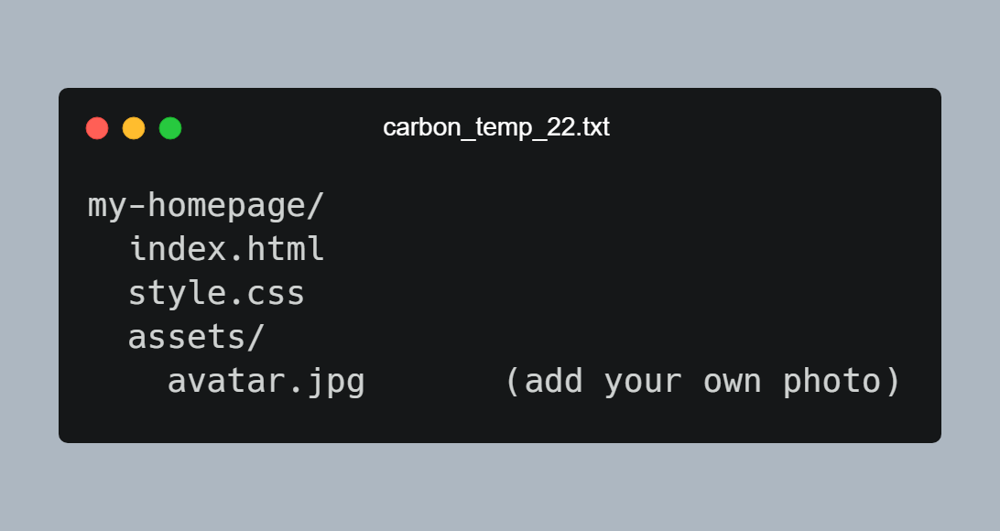

```
my-homepage/
  index.html
  style.css
  assets/
    avatar.jpg       (添加你自己的照片)
```

**提示：**

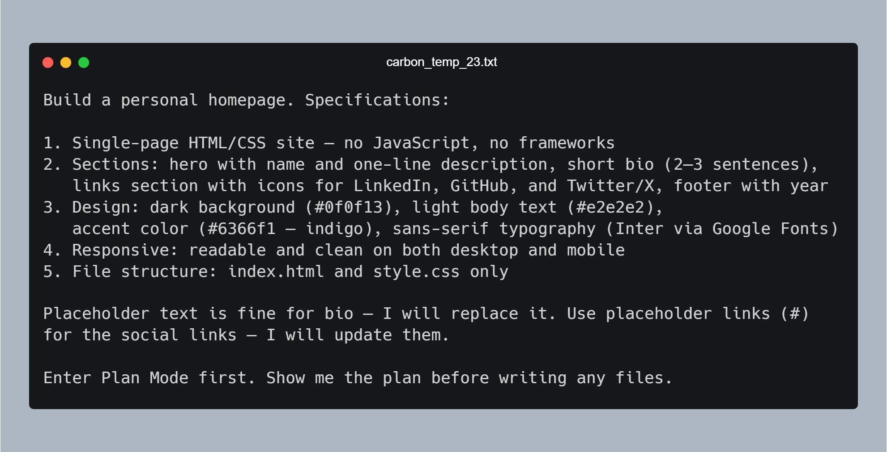

```
构建一个个人主页。规格：

1. 单页 HTML/CSS 网站——没有 JavaScript，没有框架
2. 部分：带有名字和一行描述的英雄区，简短介绍（2-3句话），
   带有 LinkedIn、GitHub 和 Twitter/X 图标的链接区，带有年份的页脚
3. 设计：深色背景（#0f0f13），浅色正文文本（#e2e2e2），
   强调色（#6366f1——靛蓝色），无衬线字体（通过 Google Fonts 使用 Inter）
4. 响应式：在桌面和移动设备上都可读且干净
5. 文件结构：只有 index.html 和 style.css

首先进入计划模式。在写任何文件之前向我展示计划。
```

### 蓝图 2：带 localStorage 的任务管理器

**适合：** 早期中级

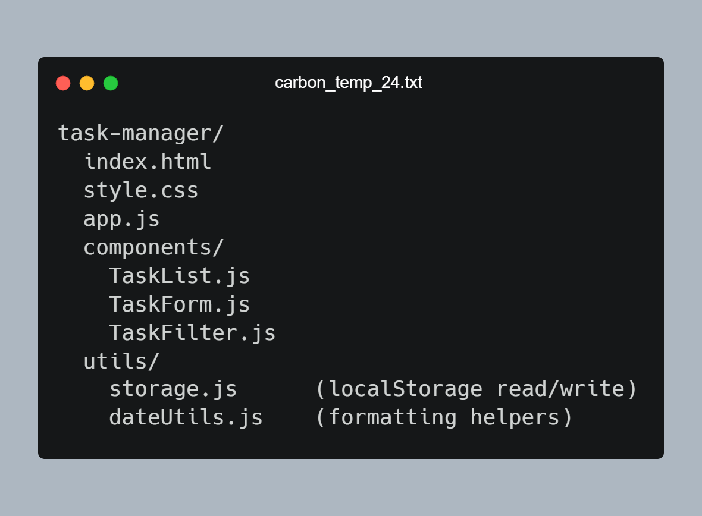

```
task-manager/
  index.html
  style.css
  app.js
  components/
    TaskList.js
    TaskForm.js
    TaskFilter.js
  utils/
    storage.js      (localStorage 读/写)
    dateUtils.js    (格式化辅助函数)
```

### 蓝图 3：API 连接的数据仪表板

**适合：** 中级

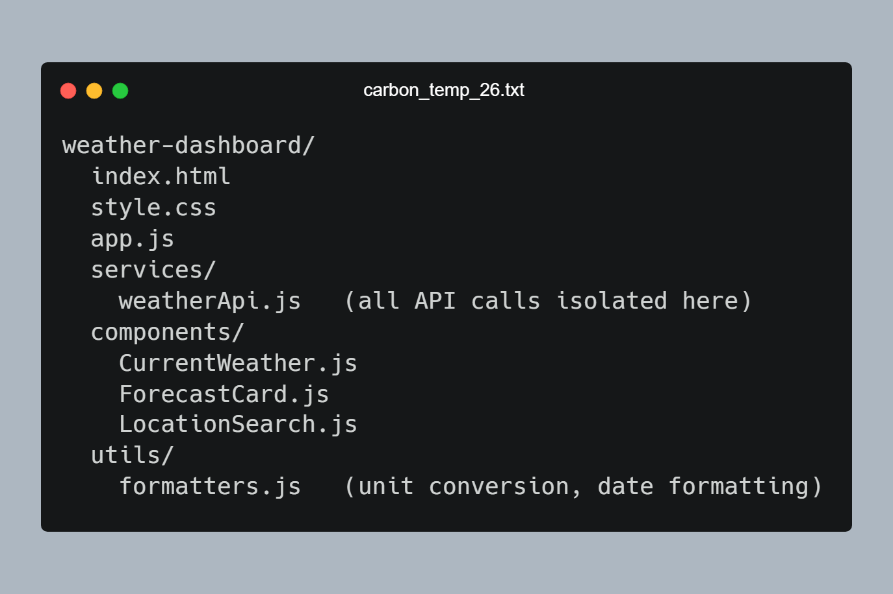

```
weather-dashboard/
  index.html
  style.css
  app.js
  services/
    weatherApi.js   (所有 API 调用隔离在这里)
  components/
    CurrentWeather.js
    ForecastCard.js
    LocationSearch.js
  utils/
    formatters.js   (单位转换，日期格式化)
```

### 蓝图 4：全栈笔记应用程序

**适合：** 中高级

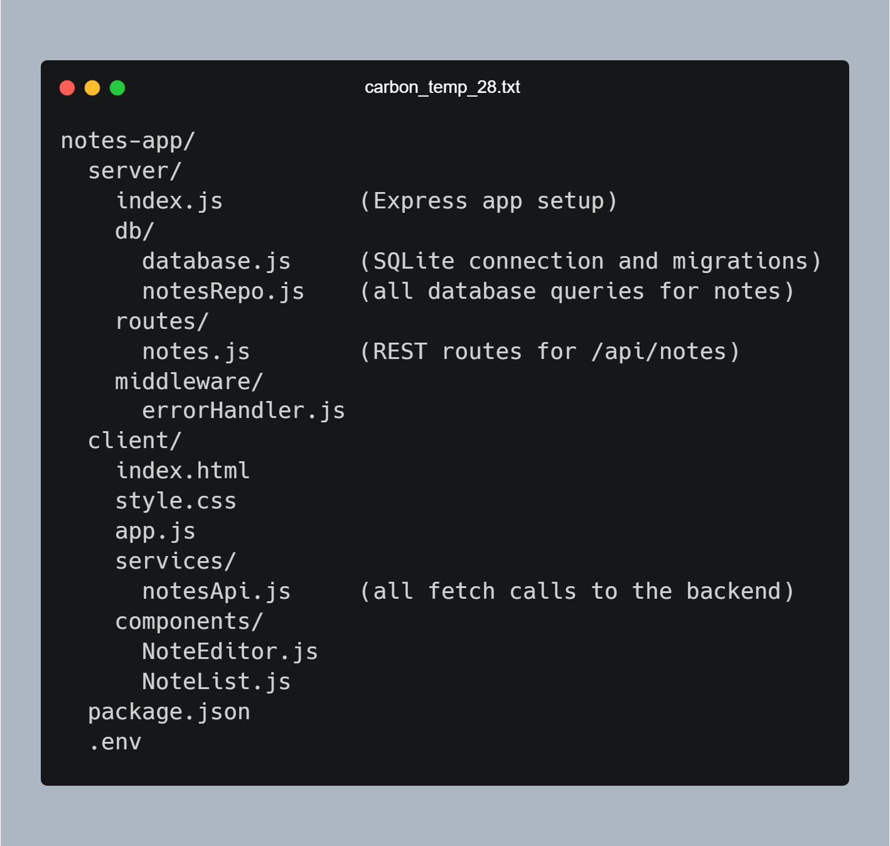

```
notes-app/
  server/
    index.js          (Express 应用设置)
    db/
      database.js     (SQLite 连接和迁移)
      notesRepo.js    (笔记的所有数据库查询)
    routes/
      notes.js        (/api/notes 的 REST 路由)
    middleware/
      errorHandler.js
  client/
    index.html
    style.css
    app.js
    services/
      notesApi.js     (所有到后端的 fetch 调用)
    components/
      NoteEditor.js
      NoteList.js
  package.json
  .env
```

### 蓝图 5：CLI 自动化工具

**适合：** 对命令行有一定了解的开发者

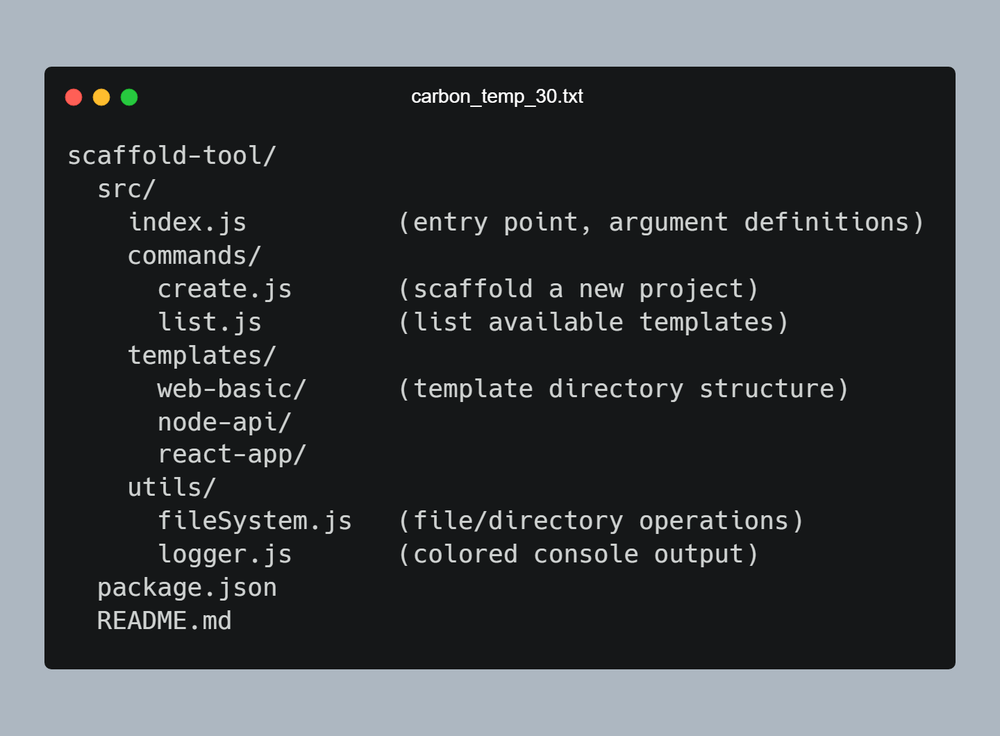

```
scaffold-tool/
  src/
    index.js          (入口点，参数定义)
    commands/
      create.js       (脚手架新项目)
      list.js         (列出可用模板)
    templates/
      web-basic/      (模板目录结构)
      node-api/
      react-app/
    utils/
      fileSystem.js   (文件/目录操作)
      logger.js       (彩色控制台输出)
  package.json
  README.md
```

### 蓝图 6：内部团队工具

**适合：** 高级中级

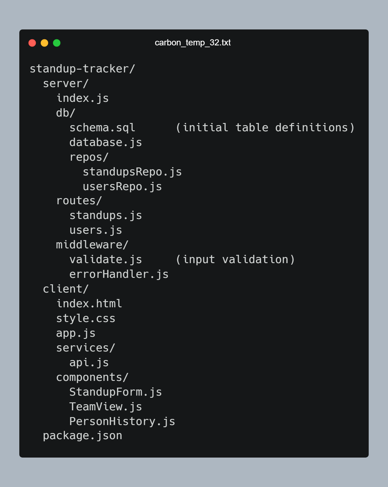

```
standup-tracker/
  server/
    index.js
    db/
      schema.sql      (初始表定义)
      database.js
      repos/
        standupsRepo.js
        usersRepo.js
    routes/
      standups.js
      users.js
    middleware/
      validate.js     (输入验证)
      errorHandler.js
  client/
    index.html
    style.css
    app.js
    services/
      api.js
    components/
      StandupForm.js
      TeamView.js
      PersonHistory.js
  package.json
```

### 蓝图进阶路径

| 蓝图 | 引入的关键模式 |
|------|---------------|
| 1. 主页 | 文件结构，静态 HTML/CSS |
| 2. 任务管理器 | JavaScript 状态，localStorage，组件分离 |
| 3. API 仪表板 | 外部 API，async/await，加载和错误状态 |
| 4. 笔记应用 | 后端 + 前端，REST，数据库 CRUD |
| 5. CLI 工具 | 命令行接口，模板化，文件系统自动化 |
| 6. 团队工具 | 多用户，验证层，生产就绪 |

---

## 第23章：Claude Code 的当前前沿

### 主动任务生成

Claude Code 开始基于观察到的项目信号生成可操作建议——不仅仅执行开发者指定的任务，而是识别值得关注的任务。

Boris 描述当前状态：Claude 读取 Slack 反馈线程，检查 GitHub 问题跟踪器，审查遥测数据，并提出带有相关 PR 的建议：*"这里有一些我可以做的事情。我已经提了几个 PR。想看看吗？"*

### 超越软件开发

Boris 对当前状态的评估：*"编码基本上已解决——至少是我做的那种编码。"* 因此，前沿正在扩展到相邻领域。

### 为六个月后的模型构建

Boris 最可操作的战略指导：**"为六个月后的模型构建，而不是为今天的模型。"**

---

## 第24章：软件工程作为一门学科

### 与软件的三个层次互动

1. **编程**是将逻辑转化为代码。这是机械层。
2. **软件工程**是可靠、可维护系统的设计和构建。需要关于架构、测试策略的判断。
3. **软件架构**是做出决定系统可以成为什么的结构性决策的学科。

Claude Code 处理编程层的很大一部分。工程和架构层仍然是人类的责任。

### 保持学习的必要性

- **系统如何工作**：理解查询索引、外键约束、会话令牌验证等
- **为什么设计决策存在**：关注点分离、依赖反转等不仅仅是官僚约定
- **质量看起来像什么**：可读的代码、一致的行为、优雅的错误处理

---

## 第25章：结构化的前进路径

### 本周开始

**结构化的第一周：**

- **第 1 天：** 安装 VS Code 和 Claude Code 扩展。配置账户。理解界面
- **第 2 天：** 定义第一个项目。写下五个具体功能。还不要开始构建
- **第 3 天：** 使用计划模式与 Claude 讨论项目。实现功能 1
- **第 4 天：** 测试功能 1。实现功能 2
- **第 5 天：** 完善项目。请 Claude 根据原始规格审查它
- **第 6 天：** 与可以给你诚实反馈的人分享项目
- **第 7 天：** 评估这周。什么比预期更难？你接下来想构建什么？

### 发展序列

| 阶段 | 重点 |
|------|------|
| **阶段 1 — 入门（第 1-4 周）** | 基于 Web 的项目。单功能范围 |
| **阶段 2 — 构建（第 1-3 个月）** | 多功能项目。数据库、API |
| **阶段 3 — 专业实践（第 3-6 个月）** | 全栈应用。部署和生产考虑 |
| **阶段 4 — 高级操作（第 6 个月及以后）** | 并行代理工作流。自主循环 |

### 持续成长的原则

1. **分析每个意外输出**
2. **阅读并理解 Claude 编写的代码**
3. **研究你认为优秀的软件**
4. **自己写一些代码**

---

## 附录 A：Claude Code 命令参考

| 命令 | 功能 |
|------|------|
| `/help` | 显示所有可用命令 |
| `/model` | 选择活动模型（Sonnet、Opus、Haiku）|
| `/permissions` | 审查和修改 Claude Code 的权限 |
| `/clear` | 重置当前会话上下文 |
| `Shift+Tab (×2)` | 激活计划模式（终端）|
| `Ctrl+C` | 中断当前操作 |
| `@filename` | 在提示中引用特定文件 |
| `/mcp` | 管理连接的 MCP 服务器 |

---

## 附录 B：标准提示模板

**开始新功能：**

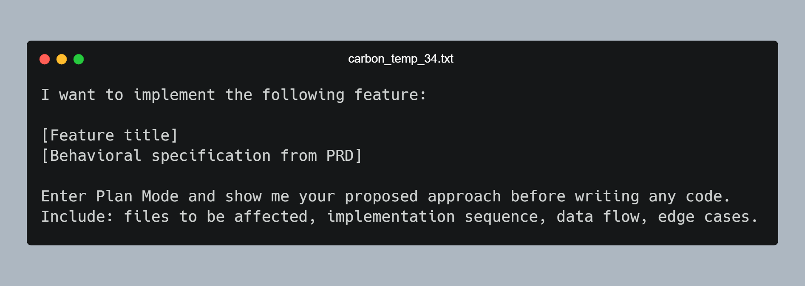

```
我想实现以下功能：

[功能标题]
[来自 PRD 的行为规格]

进入计划模式并在编写任何代码之前展示你提议的方法。
包括：将受影响的文件、实现顺序、数据流、边缘情况。
```

**诊断缺陷：**

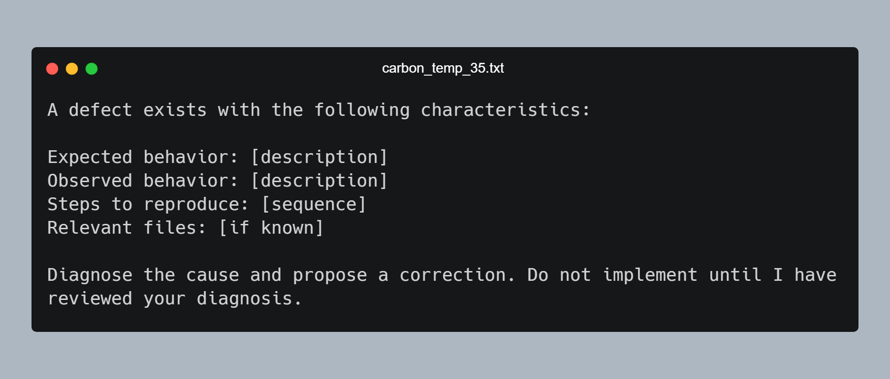

```
存在以下特征的缺陷：

预期行为：[描述]
观察到的行为：[描述]
重现步骤：[序列]
相关文件：[如果知道]

诊断原因并提出修正。在我审查你的诊断之前不要实现。
```

**代码审查：**

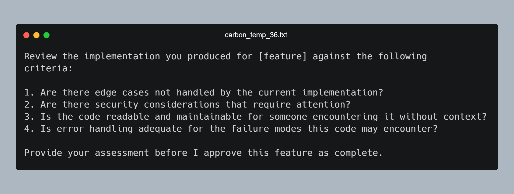

```
根据以下标准审查你为 [功能] 产生的实现：

1. 当前实现没有处理的边缘情况？
2. 需要注意的安全考虑？
3. 代码对于没有上下文遇到它的人是否可读和可维护？
4. 错误处理对于这段代码可能遇到的失败模式是否足够？

在我批准此功能为完成之前提供你的评估。
```

**新会话的上下文加载：**

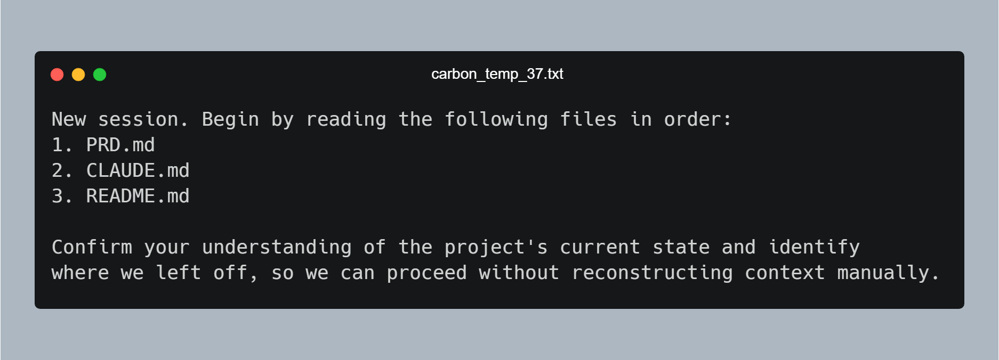

```
新会话。按顺序阅读以下文件：
1. PRD.md
2. CLAUDE.md
3. README.md

确认你对项目当前状态的理解并识别我们停在哪里，
这样我们可以继续而无需手动重建上下文。
```

---

## 附录 C：参考资料

**Anthropic 文档**
- [claude.ai](https://claude.ai) — 账户管理和 Claude.ai 访问
- [code.claude.ai](https://code.claude.ai) — Claude Code 安装和官方文档

**基础阅读**
- [The Bitter Lesson](http://www.incompleteideas.net/IncIdeas/BitterLesson.html) — Rich Sutton
- [A Philosophy of Software Design](https://www.goodreads.com/book/show/39996759-a-philosophy-of-software-design) — John Ousterhout
- [Fundamentals of Software Architecture](https://fundamentalsofsoftwarearchitecture.com/) — Mark Richards 和 Neal Ford

**对 Web 开发新手**
- [The Odin Project](https://www.theodinproject.com/) — 免费、基于项目的课程
- [freeCodeCamp](https://www.freecodecamp.org/) — 免费、结构化的课程

---

## 结语

本手册写于 2026 年 2 月。Claude Code 的具体内容——它的功能、模型能力、界面——将继续发展。这里写的一些内容将在几个月内需要更新。

**底层原则不会。**

你用 Claude Code 构建的东西的质量由你规划的质量、你沟通的精确性、你验证的严谨性和你标准的清晰度决定。这些是实践的属性，不是工具的属性。它们复合。它们不会过期。

重要的积累不是你编写的代码。而是你通过构建真实的东西、研究他人构建的东西、以及理解将持久的工作与不持久的工作区分开来的标准而发展的**判断**。这种积累不能被 AI 代理复制。它是你的。

---

> **原文链接**：https://www.freecodecamp.org/news/claude-code-handbook/
> 
> **图片说明**：本文所有图片已下载到 `images/` 目录，使用本地相对路径引用
